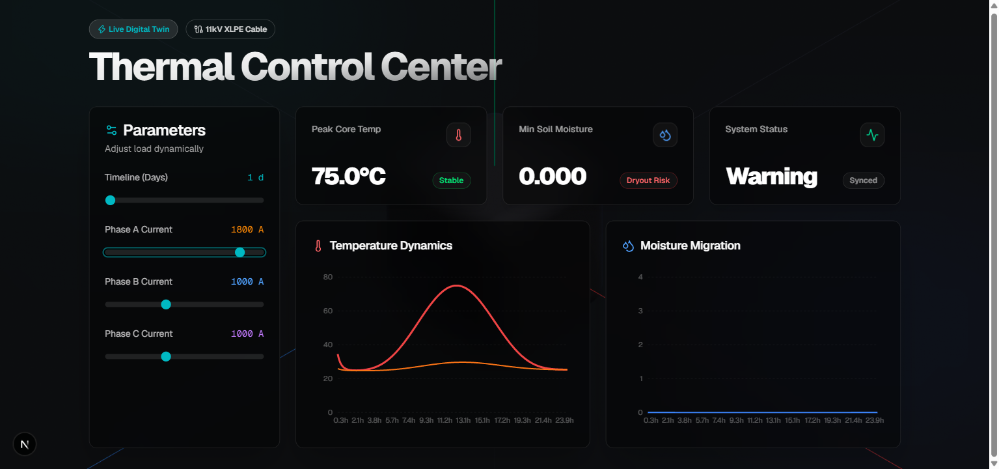

# FourierTherm: FNO-Driven Cyber-Physical Digital Twin

 <!-- Update this path with an actual screenshot later if you'd like! -->

A full-stack, real-time Digital Twin simulation for monitoring thermal dynamics and moisture migration in high-voltage (11kV XLPE) underground power cables.

This project bridges complex physics simulations (Runge-Kutta 4 numerical integration) with a highly interactive, fluid, and visually stunning modern web dashboard.

## 🚀 Features

- **Real-Time Physics Engine:** Accurately simulates core temperatures, sheath temperatures, and soil moisture dry-out over time using a Python-based physical model.
- **Interactive Digital Twin:** Dynamically adjust Phase A, Phase B, Phase C currents and simulation timelines via the web dashboard and instantly see the physical impact.
- **Masterpiece UI/UX:** Built with a modern glassmorphism design, fluid background animations (Framer Motion), 3D assets (Spline), and interactive data visualization (Recharts).
- **Full-Stack Architecture:**
  - **Backend:** High-performance REST API built with **FastAPI** and Python.
  - **Frontend:** Robust, reactive UI built with **Next.js**, React, and Tailwind CSS.
  - **Math/Simulation:** `numpy` and `scipy` powering the RK4 integration.

## 🛠️ Tech Stack

**Frontend:**

- Next.js (React)
- Tailwind CSS (Styling & Glassmorphism)
- Framer Motion (Fluid animations and micro-interactions)
- Recharts (Time-series data visualization)
- Lucide React (Icons)
- Spline (3D web assets)

**Backend:**

- Python 3
- FastAPI (REST API framework)
- Uvicorn (ASGI web server)
- Numpy / Scipy (Numerical physics integration)
- Pydantic (Data validation)

## 💻 Getting Started

### 1. Start the Backend Physics API

Open a terminal in the root directory and activate your Python virtual environment, then start the FastAPI server:

```bash
# Windows
.\.venv\Scripts\activate
python api.py

# Mac/Linux
source .venv/bin/activate
python api.py
```

_The API will run on `http://localhost:8000`. You can view the auto-generated documentation at `http://localhost:8000/docs`._

### 2. Start the Frontend Dashboard

Open a second terminal, navigate to the `frontend` folder, and start the Next.js development server:

```bash
cd frontend
npm install
npm run dev
```

_The dashboard will run on `http://localhost:3000`._

## 🔬 How it Works

1. **The User Input:** The user adjusts load currents (Amps) and the simulation timeline (Days) using the sliders on the dashboard.
2. **The Request:** Next.js sends this configuration as a JSON payload via an HTTP POST request to the FastAPI backend.
3. **The Simulation:** The Python engine calculates the steady-state initialization and then runs a continuous Runge-Kutta 4 (RK4) integration at 1-minute intervals (`dt=60`). It factors in cyclic daily temperature variations and load multipliers.
4. **The Response:** FastAPI returns the generated time-series data for the core, sheath, and soil temperatures, as well as the moisture dry-out fraction.
5. **The Visualization:** Recharts dynamically renders the threshold bounds, critical warnings, and multiple physical properties in an intuitive, multi-line graphical format.

## 📝 License

This project is licensed under the MIT License - see the [LICENSE](LICENSE) file for details.
